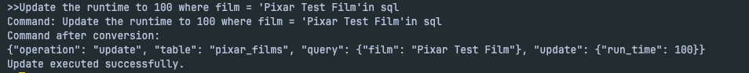

## Google Drive/GitHub Link
https://github.com/Howard-Pai/ChatDB.git
---

## Introduction
The goal of this project is to develop **ChatDB**, a natural language interface (NLI) that allows users to interact with database management systems (DBMS) through conversational queries. ChatDB enables users to explore database schemas, retrieve data, and modify it—all by inputting queries in natural language. The system integrates with both **Relational Database Management Systems (RDBMS)** and **NoSQL databases**, specifically MySQL and MongoDB, respectively, to provide comprehensive database management capabilities.

This project utilizes advanced Natural Language Processing (NLP) techniques to convert human-readable queries into SQL or MongoDB commands that can be executed by the respective database systems. Users can request schema exploration, issue SELECT queries, perform JOIN operations, and even modify data (insert, update, delete) directly using plain language.

In addition, **ChatDB** supports multiple datasets to demonstrate its flexibility across different types of databases. For example, the project integrates with datasets from the **Pixar** and **Toys** domains, allowing users to query data related to films, products, stores, and sales.

Key features include:

- Database schema exploration (e.g., listing tables, retrieving sample data)
- Querying capabilities (SELECT, JOIN, WHERE clauses, etc.)
- Data modification (INSERT, UPDATE, DELETE)
- Integration with both RDBMS and NoSQL (MongoDB)

The project leverages modern **Large Language Models (LLMs)**, like OpenAI's GPT-4o-mini, to process and interpret user queries, translating them into database-specific commands.

---

## Planned Implementation (From Project Proposal)
Initially, our plan was to develop a **natural language interface (NLI)** for querying a **stock exchange database**, supporting both **SQL** and **NoSQL** systems. We intended to use **MySQL**, **PostgreSQL**, and **MongoDB** to build the system, and utilize **OpenAI GPT-4** or other large language models to convert natural language queries into SQL commands, with functionality to support querying, data modification, and more. The original goal was to focus on stock data analysis and queries, supporting complex operations like **JOIN** and **data modification**.

However, during the course of the project, we realized that the **stock exchange database** project had already been explored by many other teams, which led us to adjust our focus. As a result, we decided to shift our attention toward developing a more generalized **ChatDB** system, a natural language interface capable of querying and synthesizing features from different datasets.

The new direction for the project is to create a **universal natural language interface (ChatDB)** that will support querying not just stock databases but also other types of data, such as **Pixar films**, **toy sales**, and **restaurant menu data**.

### Key Changes:

1. **Data Scope Expansion**: Instead of focusing solely on the stock exchange database, the project now incorporates datasets like **Pixar**, **Toy sales**, and **Restaurant menu** data.
2. **Database Selection**: We are still using **MySQL** and **PostgreSQL** for relational databases but have also integrated **MongoDB** for NoSQL data.
3. **Model Update**: While we continue to use **OpenAI GPT-4** and other large language models to process natural language queries, the focus has shifted from to synthesizing different features from the data, which may reveal correlations or causal relationships with stock prices or other financial indicators to simple generate queries.
4. **Interface Development**: The new ChatDB system will allow users to interact with it via natural language.

The ultimate goal of this project is to create a flexible and user-friendly system that allows users to interact with different databases using natural language.

---

## Architecture Design
### Flow Diagram

### Description
1. Start: The process begins when a user inputs a query in natural language.

2. Natural Language Processing: The query, along with the relevant data structure, is passed to an LLM (Large Language Model). The LLM interprets the input and generates a corresponding structured query.

3. Query Type Detection:

    - The output from the LLM is analyzed to determine its type.

    - If the generated query is identified as an SQL query, it is directed to a MySQL database.

    - If the query is not SQL, the system checks if it is a NoSQL query.

        - If it is a NoSQL query, it is executed in MongoDB.

        - If the query is neither SQL nor NoSQL, the system returns an Error.

4. Output:

    - If executed in MySQL, the system produces an SQL output.

    - If executed in MongoDB, the system produces a NoSQL output.

    - In case of an error, an Error message is generated.

5. End: The workflow concludes after delivering the output or error response.

---

## Implementation

### 1. Functionalities

The **ChatDB** project enables users to interact with multiple database systems using **natural language**. The system is designed to convert user inputs in plain English (or other languages) into SQL or MongoDB commands for querying and modifying databases. The key functionalities of the system include:

#### 1.1. **Natural Language to SQL Conversion**

- The system uses advanced **Natural Language Processing (NLP)** techniques to understand user queries and convert them into executable SQL commands. It supports standard SQL constructs like `SELECT`, `FROM`, `WHERE`, `JOIN`, `GROUP BY`, `ORDER BY`, and `LIMIT`.
    
- For example, if a user asks, "Show me all films from Pixar," the system can translate this into a SQL query like `SELECT * FROM pixar_films`.
    

#### 1.2. **Data Exploration**

- ChatDB allows users to explore the schema of the database in natural language. Users can ask questions such as:
    
    - "What tables are available in the database?"
    - "What columns does the `movies` table have?"
    - "Show me sample data from the `products` table."
        
- These queries are translated into appropriate database commands to retrieve the schema or sample data and display it to the user in a readable format.
    

#### 1.3. **Data Modification**

- Users can modify data directly using natural language commands such as:
    
    - **Insert**: "Add a new product called 'Toy Car' with price $15."
    - **Update**: "Update the price of 'Toy Car' to $10."
    - **Delete**: "Delete all records where stock is zero."
        
- The system processes these commands and executes the appropriate SQL or MongoDB operations (`INSERT`, `UPDATE`, `DELETE`).
    

#### 1.4. **Multi-database Support**

- The system is capable of interacting with both **relational databases** (MySQL) and **NoSQL databases** (MongoDB). It automatically determines which database to query based on the structure and syntax of the input query. For example, a query for a `JOIN` operation will be converted into SQL for relational databases, while data retrieval operations in MongoDB will use the appropriate NoSQL query syntax.
    
    

### 2. Tech Stack

The **ChatDB** project leverages a modern stack of technologies and tools to support its functionalities. The tech stack includes the following components:

#### 2.1. **Backend**

- **Python**: The backend is built using Python, a versatile language ideal for data processing, and API development.
    

#### 2.2. **Database**

- **MySQL**: A relational database management system (RDBMS) used for storing structured data. ChatDB interacts with MySQL to process SQL queries and modify data.
    
- **MongoDB**: A NoSQL database used to handle unstructured or semi-structured data, providing flexibility for storing data in JSON-like documents.
    

#### 2.3. **NLP Model**

- **OpenAI GPT-4**: OpenAI’s GPT models are used to process the natural language queries and convert them into structured SQL or MongoDB queries. These models are powerful for understanding the context of user input and generating appropriate database queries
    

#### 2.5. **Other Tools**

- **SQLAlchemy**: An ORM (Object-Relational Mapper) for Python that abstracts the complexity of direct SQL queries. It provides a more Pythonic interface to interact with relational databases.
    
- **pymysql/psycopg2**: Libraries used to connect to MySQL and PostgreSQL databases, respectively, and execute SQL queries.
    
- **pymongo**: A Python driver for MongoDB used to handle operations and queries in the NoSQL database.

### 3. Implementation Screenshots

---

## Learning Outcomes
Working on this project has been an incredibly rewarding experience. Not only have we learned a lot about **Natural Language Processing (NLP)** and its application to databases, but we've also gained deeper insights into how real-world systems handle complex interactions between databases and users.

One of the most exciting aspects of this project was integrating **NLP with SQL and NoSQL databases**. Before starting, We had a basic understanding of how databases work and how queries are executed. But seeing it all come together—where a simple natural language request like "Show me the sales data for toys in New York" can be translated into an actual SQL or MongoDB query—felt like magic. It really made me appreciate how powerful NLP can be in making technology more accessible to users who may not be familiar with coding or database structures.

The project also gave us hands-on experience with some awesome **tech stacks**. We worked a lot with **Python** and **SQLAlchemy** on the backend, which was super useful in building a robust system. Plus, integrating **OpenAI's GPT-4** (or GPT-3.5 for the lighter version) to process natural language and generate SQL queries was a game-changer. We were amazed at how efficiently the model handled ambiguous queries and still managed to return results that were contextually relevant. It gave us a whole new level of respect for **LLMs** and the potential they have to revolutionize various industries.

The challenge of integrating multiple databases—**MySQL**, **PostgreSQL**, and **MongoDB**—and ensuring that ChatDB worked seamlessly across these platforms was both challenging and rewarding. It gave us practical experience in managing relational and NoSQL systems, and we gained a much better understanding of their differences, use cases, and how they interact with one another.

Finally, seeing everything come together—the frontend, backend, and NLP processing—was just really satisfying. The idea of users being able to interact with data in such an intuitive way felt like a huge leap toward the future of **user-centric technology**. This project not only improved my technical skills but also made me realize the potential of **AI-driven tools** in making data-driven decisions much more accessible.

This project has been an amazing learning journey, and I’m excited about the endless possibilities of what we can build in the future, especially when you combine **AI**, **data**, and **user experience** in such a seamless way.

---

## Challenges Faced
Throughout the course of this project, we encountered several challenges that tested our problem-solving skills and forced us to adapt and rethink our approach.

One of the biggest hurdles came when we had to shift our focus from a **stock exchange database** to a more generalized **ChatDB** system. While the original plan seemed straightforward, the reality of integrating multiple datasets—like those from **Pixar films**, **toys sales**, and **restaurant menu data**—required us to rethink our entire design. The need to adapt to different data types and ensure that our system could handle varied queries across different domains meant that we had to invest a lot of time in designing flexible query generation and schema exploration mechanisms. This change, though necessary, took us a bit off-track from our initial plans and caused some delays.

A significant challenge came from working with two very different types of databases: **relational databases** (MySQL) and **NoSQL databases** (MongoDB). Each of these systems has its own set of requirements for querying, schema design, and data management. When designing the schema and figuring out how to structure data for both systems, we often found ourselves at a crossroads. Relational databases require a rigid, tabular structure, while NoSQL databases are more flexible and document-based. This difference led to constant struggles in designing queries and ensuring that the data could be accessed seamlessly across both systems. The logic needed to translate queries from one structure to another was complex, and sometimes we were unsure of the best approach to unify the two database types under a single system.

Another challenge we faced was **token efficiency**. As we integrated **OpenAI's GPT-4** for natural language processing, we realized that handling large queries, especially across multiple databases, was consuming a significant amount of tokens. Since token usage directly impacts the cost and performance of the system, we had to figure out ways to optimize how we communicated with the language model. This meant being very mindful of the amount of data we sent to the LLM in every query, ensuring that we didn’t overwhelm it with unnecessary details. This became especially difficult when users wanted to explore schemas or issue complex queries involving multiple tables or collections, as each additional detail required more tokens to process. We had to carefully design our queries and implement token-saving strategies—like truncating large responses or breaking down complex queries into smaller, more manageable parts—to ensure we were not exceeding token limits unnecessarily.

Finally, working with a **multi-database system** introduced additional challenges related to data consistency and performance optimization. Ensuring that queries returned accurate results across different database types was a delicate balance. We had to account for the differences in how data is stored and queried in relational versus NoSQL databases, which required constant tweaking and refinement of our system to achieve reliable performance. There were moments when one database would perform well with certain queries while the other would struggle, and fine-tuning the system to handle both efficiently was a constant challenge.

Despite these hurdles, the experience was incredibly valuable and rewarding. It pushed us to think creatively about how to bridge the gap between relational and NoSQL systems and how to optimize the interaction between natural language queries and database backends. Ultimately, overcoming these challenges helped us build a much more robust and flexible system than we originally envisioned.

---

## Individual Contribution
**Hsu Tse-Chun**:  
Hsu Tse-Chun was primarily responsible for the design and integration of the **Large Language Model (LLM)**, as well as the related API interactions. He played a key role in developing the system that processes natural language input and converts it into SQL or MongoDB queries. This included handling the communication between the backend and the LLM API to ensure smooth query generation. Hsu also took charge of working with **JSON schema** to ensure the system could properly process and interpret the schema of different datasets, making sure that the model had all the necessary information to generate accurate queries. Additionally, he focused on optimizing the LLM's performance, particularly in terms of prompt engineering to reduce randomness and improve consistency in query generation.

**Chih-Yun Pai**:  
Chih-Yun Pai was responsible for the entire **data management** and **ETL (Extract, Transform, Load)** process. He handled the setup and management of the **databases** (MySQL, MongoDB), ensuring that they were properly configured and optimized for the project. Chih-Yun was also in charge of the **data processing pipeline**, from loading data into the system to managing how queries interacted with the databases. One of his key contributions was in reducing the **randomness** of the LLM’s responses. By refining how data was presented to the LLM, Chih-Yun helped improve the consistency and accuracy of the results returned, ensuring that the system could reliably process user queries and handle complex data modifications.

---

## Conclusion

This project has been an incredibly enriching and rewarding experience. From the very beginning, our goal was to create a natural language interface that could interact with multiple types of databases, making data access more intuitive and user-friendly. Over the course of the project, we were able to achieve this vision by developing **ChatDB**, a system that allows users to interact with databases using natural language queries.

We successfully integrated **MySQL**, and **MongoDB**, allowing the system to query and modify data across different database types. Through the use of **OpenAI's GPT-4**, we were able to convert user queries into SQL and NoSQL commands, creating a seamless user experience. Additionally, by incorporating features like **schema exploration** and **data modification**, we made the system versatile enough to handle a variety of use cases, from basic queries to more advanced data insights.

Throughout the project, we encountered several challenges, particularly when working with multiple databases, handling the differences in their structures, and optimizing our interactions with the **LLM**. However, these challenges pushed us to develop creative solutions, and we gained valuable experience in **database management**, **natural language processing**, and **system optimization**.

This project not only deepened our understanding of databases and NLP, but it also taught us the importance of flexibility and adaptability when designing complex systems. Looking ahead, there is great potential to expand this system into even more complex applications, especially as **AI-driven tools** continue to evolve.

---

## Future Scope

While **ChatDB** has successfully met its core objectives, there are several exciting possibilities for future development and expansion. As we continue to explore and refine the system, there are key areas that could be enhanced to improve both its functionality and user experience:

### 1. **Support for More Databases**

Currently, **ChatDB** supports MySQL, PostgreSQL, and MongoDB. However, there is potential to expand support to other popular databases such as **SQLite**, **Oracle**, and **Cassandra**. By making the system compatible with more database types, ChatDB could be applied to a wider range of use cases across different industries and environments.

### 2. **Enhanced Natural Language Understanding**

Although the system works well with basic queries, there is always room for improvement in how it understands and processes more complex or ambiguous natural language input. Future updates could include the integration of more advanced **NLP models** to handle a broader array of queries, improve **contextual understanding**, and reduce the randomness in responses. This would enable ChatDB to interpret more nuanced or advanced user requests, making the system even more flexible and user-friendly.

### 3. **Query Optimization and Caching**

In order to handle larger datasets and ensure faster response times, future versions of ChatDB could incorporate **query optimization techniques**. By analyzing the performance of queries and caching common results, the system could provide quicker responses, particularly for frequently asked queries. This would enhance the overall performance and scalability of the system, especially when working with large databases.

### 4. **Advanced Data Analytics and AI-Driven Insights**

Looking ahead, **ChatDB** could evolve to provide more advanced data analytics and **AI-driven insights**. By leveraging machine learning algorithms, the system could automatically detect patterns, correlations, and trends in the data, offering users valuable insights without needing to issue complex queries. For example, it could suggest potential relationships between variables or generate predictive models based on historical data, making it a powerful tool for decision-making and data exploration.

### 5. **User Interface Enhancements**

While the current system provides a functional interface, there is potential to improve the user experience further with a more intuitive and interactive **web or mobile interface**. Integrating **graphical data visualizations**, such as charts and graphs, would make the insights and query results more accessible. Additionally, incorporating voice recognition for **voice-based queries** could make the system even more user-friendly, especially for those who prefer hands-free interactions.

### 6. **Security and Privacy Features**

As **ChatDB** evolves and potentially handles more sensitive data, adding **robust security** and **privacy features** will be essential. Implementing access control, data encryption, and other security measures would ensure that users' data is protected and only accessible to authorized individuals, especially in enterprise settings.

### 7. **Integration with External APIs and Data Sources**

In the future, **ChatDB** could be extended to integrate with **external APIs** and **data sources**. This would allow users to query and combine data from different platforms, such as financial services, social media, or IoT devices, creating a more dynamic and interconnected system. For example, users could ask the system to combine sales data from the database with real-time stock prices, enabling more complex and insightful analyses.
